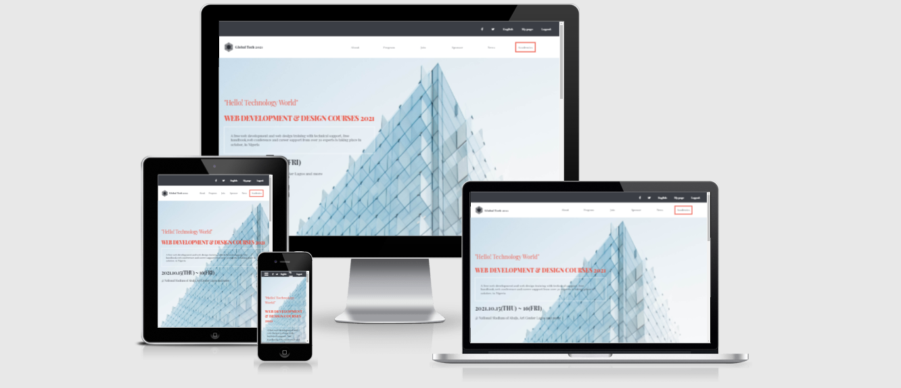

# HTML-CAPSTONE-PROJECT

> This project is a Microverse HTML and basic JS capstone about building a web page that showcase the knowledge of Semantic HTML, CSS selectors, CSS box-model, flexbox, background properties, mobile-first responsive web design, CSS media query, DOM manipulation, event listener, arrow function, let and const, Javascript Object, Arrays, String interpolation, Github pages.

## Built With

- Semantic HTML & CSS
- JavaScript
- Github workflow
- Linters(Lighthouse, stylelint, Webhint, eslint)

## Live Preview

[Github deploy Page](https://bimbolabuari.github.io/mv-html-capstone/)

## Author

👤 **Abimbola Aminat Buari**

- GitHub: [bimbolabuari](https://github.com/bimbolabuari)
- Twitter: [bimbolabuari](https://twitter.com/bimbolabuari)
- LinkedIn: [bimbolabuari](https://linkedin.com/in/bimbolabuari)

## 🤝 Contributing

Contributions, issues, and feature requests are welcome!

Feel free to check the [issues page](../../issues/).

## Show your support

Give a ⭐️ if you like this project!

## Acknowledgments

- Microverse
- [Cindy Shin in Behance](https://www.behance.net/gallery/29845175/CC-Global-Summit-2015)
- Code reviewer(s).

## 📝 License

[MIT licensed](./LICENSE).
